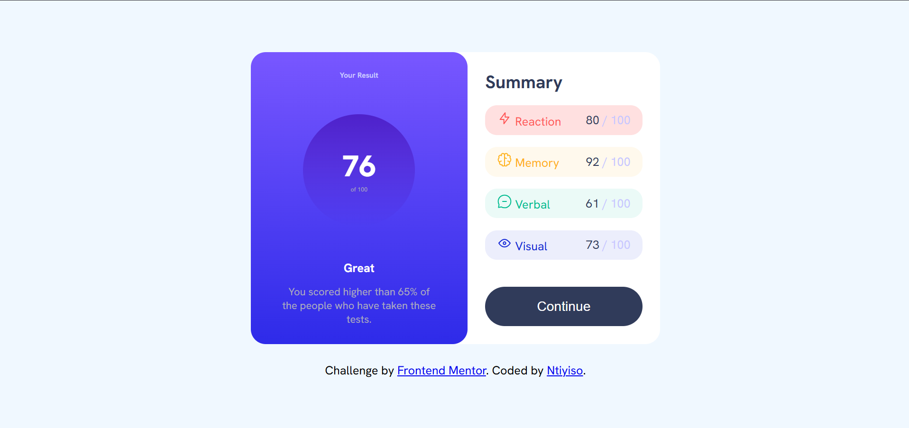

# Frontend Mentor - Results summary component solution

This is a solution to the [Results summary component challenge on Frontend Mentor](https://www.frontendmentor.io/challenges/results-summary-component-CE_K6s0maV). Frontend Mentor challenges help you improve your coding skills by building realistic projects. 

## Table of contents

- [Overview](#overview)
  - [The challenge](#the-challenge)
  - [Screenshot](#screenshot)
  - [Links](#links)
- [My process](#my-process)
  - [Built with](#built-with)
  - [What I learned](#what-i-learned)
  - [Continued development](#continued-development)
  - [Useful resources](#useful-resources)
  - [AI Collaboration](#ai-collaboration)
- [Author](#author)
- [Acknowledgments](#acknowledgments)

**Note: Delete this note and update the table of contents based on what sections you keep.**

## Overview

### The challenge

Users should be able to:

- View the optimal layout for the interface depending on their device's screen size
- See hover and focus states for all interactive elements on the page
- **Bonus**: Use the local JSON data to dynamically populate the content

### Screenshot



### Links

- Solution URL: [Solution](https://your-solution-url.com)
- Live Site URL: [Live Site](https://rikhotsontiyiso.github.io/results-summary-component/)

## My process

### Built with

- HTML5 markup
- CSS custom properties
- Flexbox

### What I learned
During this project, I learned how to:

- Build responsive layouts using Flexbox.
- Use CSS variables and HSL colors.
- Align and center elements using Flexbox.
- Create reusable CSS classes.
- Improve my understanding of spacing, typography, and component styling.

```css
.percentage {
    width: 150px;
    height: 150px;
    display: flex;
    flex-direction: column;
    justify-content: center;
    align-items: center;
    border-radius: 50%;
    background:linear-gradient(
        hsla(256, 72%, 46%, 1),
        hsla(241, 72%, 46%, 0)
        
    );
}
```

### Continued development

In future projects, I would like to improve my skills in:

- CSS Grid
- JavaScript
- Responsive web design
- Accessibility (ARIA and semantic HTML)
- Consuming JSON data with JavaScript


### AI Collaboration

I used ChatGPT during this project to:

- Debug HTML and CSS issues.
- Understand Flexbox alignment.
- Learn how to style specific elements.
- Improve my README documentation.
- Get explanations for Git and GitHub errors.


## Author

- Frontend Mentor - [@rikhotsontiyiso](https://www.frontendmentor.io/profile/rikhotsontiyiso)

## Acknowledgments

I would like to thank my teacher for the guidance, support, and encouragement throughout this project. The explanations, feedback, and practical examples helped me understand HTML and CSS better and complete the project successfully.

I would also like to thank ChatGPT for assisting me during the project. It helped me understand difficult concepts, debug my HTML and CSS code, solve Git and GitHub issues, and improve my README documentation. The explanations made it easier for me to learn and apply the concepts on my own.

